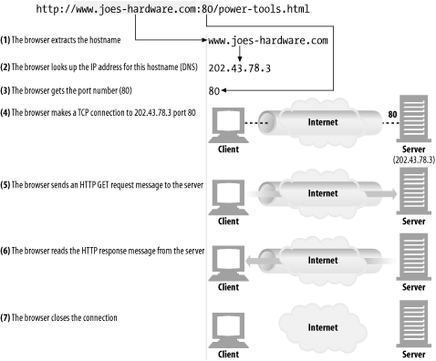
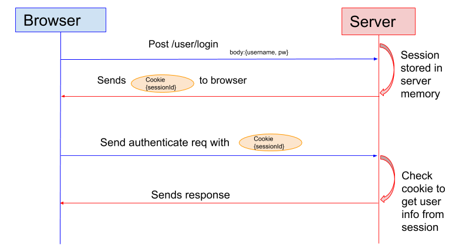
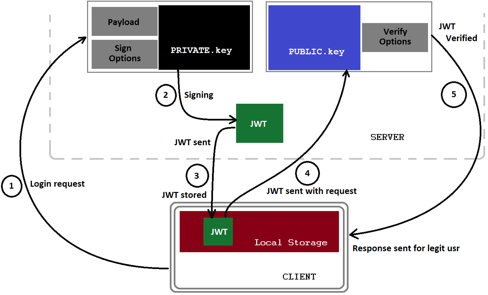

<h3 align="center">Authentication means confirming your own identity, whereas authorization means being allowed access to the system</h3><br>
 
Servers need a way to know who a user is. Once a server knows who the user is, it can decide which transactions and resources the user can access. Authentication means proving who you are; usually, you authenticate by providing a username and a secret password. HTTP provides a native facility for <b>HTTP authentication</b>. While it’s certainly possible to “roll your own” authentication facility on top of <b>HTTP forms</b> and <b>cookies</b>, for many situations, HTTP’s native authentication fits the bill nicely.

## HTTP: The Definitive Guide


<Details> 
 <Summary>definition</Summary>

- HTTP clients and HTTP servers make up the basic components of the World Wide Web
- Web servers attach a **MIME(Multipurpose Internet Mail Extensions)** type to all HTTP object data. When a web browser gets an object back from a server, it looks at the associated MIME type to see if it knows how to handle the object. Most browsers can handle hundreds of popular object types: displaying image files, parsing and formatting HTML files. MIME Type: 
`application/*`, `audio/*`, `chemical/*`, `image/*`, `message/*`, `model/*`, `multipart/*`, `text/*`, `video/*`, and `Other`
- **Transaction:** An HTTP transaction consists of a request command (sent from client to server), and a response result (sent from the server back to the client)
- Each header field consists of a name and a value, separated by a colon (:) for easy parsing
- **Connections:** Once a TCP connection is established, messages exchanged between the client and server computers will never be lost, damaged, or received out of order <br>
`Physical layer`(Physical network hardware)>`Data link layer`(Network-specific link interface)>`Network layer`(IP)>`Transport layer`(TCP)>`Application layer`(HTTP) <br> that's mean in networking terms, the HTTP protocol is layered over TCP. HTTP uses TCP to transport its message data. Beware that Telnet mimics HTTP clients well but doesn’t work well as a server.
- **Proxies:** HTTP intermediaries that sit between a client and a server, receiving all of the client’s HTTP requests and relaying the requests to the server (perhaps after modifying the requests). These applications act as a proxy for the user, accessing the server on the user’s behalf. Proxies can also filter requests and responses.
- **Caches:** A web cache or caching proxy is a special type of HTTP proxy server that keeps copies of popular documents that pass through the proxy. The next client requesting the same document can be served from the cache’s personal copy.
- Web server and web proxy messages have the same syntax, with one exception. we need to send partial URIs to servers, and full URIs to proxies. Proxies can serve as access-control devices. HTTP defines a mechanism called proxy authentication that blocks requests for content until the user provides valid access-permission credentials to the proxy. 
- **Media Types:** The client tells the server which media types it can handle, using the Accept header. The server tries to return information in one of the client’s preferred media types, and declares the type of the data using the Content-type header.
- **Persistent Connections:** The Connection header indicates whether the network connection will be maintained after the current transaction finishes. Under HTTP 1.0, the default is to close connections after each transaction, so the client must use `Connection: Keep-Alive` header in order to maintain the connection for an additional request.
- The first part of the URL (http) is the URL scheme . The scheme tells a web client how to access the resource. In this case, the URL says to use the HTTP protocol. 
- **URL Syntax:** `<scheme>://<user>:<password>@<host>:<port>/<path>;<params>?<query>#<frag>`
- **Expandomatic URLs:** Some browsers try to expand URLs automatically, either after you submit the URL or while you’re typing.
- **Shady Characters:** To get around the limitations of a safe character set representation, an encoding scheme was devised to represent characters in a URL that are not safe.
- **HTTP Connection Handling:** Parallel connections Persistent connections Pipelined connections Multiplexed connections
- **idempotent:** A transaction is idempotent if it yields the same result regardless of whether it is executed once or many times. Implementors can assume the GET, HEAD, PUT, DELETE, TRACE, and OPTIONS methods share this property.
- Strictly speaking, proxies connect two or more applications that speak the same protocol, while gateways hook up two or more parties that speak different protocols. A gateway acts as a “protocol converter".
- **Web Robots:** Web robots are software programs that automate a series of web transactions without human interaction. Many robots wander from web site to web site, fetching content, following hyperlinks, and processing the data they find.
- four areas where HTTP shows some growing pains: `Complexity`, `Extensibility`, `Performance` and `Transport dependence`

</Details>

| Code Range | Response Meaning                                                                                                                              |
| --------- | ------------------------------------------------------------------------------------------------------------------------------------------ |
| 100-199   | Informational                                                                                                                        |
| 200-299       | Client request successful                                                                                             |
|300-399    | Client request redirected, further action necessary                                                                                                                            |
| 400-499       | Client request incomplete                                                                                                               |
|500-599      |Server errors                                                                                                    |

<h1 align="center">HTTP’s Challenge/Response Authentication Framework</h1>
<p>The authentication protocol is specified in the HTTP authentication headers. HTTP defines two official authentication protocols: basicauthentication and digest authentication.
</p>

| Phase         | Headers             | Description                                                                                                           | Method/Status    |
| ------------- | ------------------- | --------------------------------------------------------------------------------------------------------------------- | ---------------- |
| Request       |                     | The first request has no authentication                                                                               | GET              |
| Challenge     | WWW-Authenticate    | The server rejects the request with a 401 status, indicating that the user needs to provide his username and password | 401 Unauthorized |
| Authorization | Authorization       | The client retries the request, but this time attaching an Authorization header                                       | GET              |
| Success       | Authentication-Info | If the authorization credentials are correct, the server returns the document                                         | 200 OK           |

base-64 encoding takes a sequence of 8-bit bytes and breaks the sequence of bits into 6-bit chunks. Each 6-bit piece is used to pick a character in a special 64-character alphabet, consisting mostly of letters and numbers. 

## The Security Flaws of Basic Authentication
- Basic authentication offers no protection against proxies or intermediaries that act as middlemen, leaving authentication headers intact but modifying the rest of the message to dramatically change the nature of the transaction. 
- Basic authentication is vulnerable to spoofing by counterfeit servers. If a user can be led to believe that he is connecting to a valid host protected by basic authentication when, in fact, he is connecting to a hostile server or gateway, the attacker can request a password, store it for later use, and feign an error. 

<p><b>Digest Authentication:</b> Digest functions sometimes are called cryptographic checksums, one-way hash functions, or fingerprint functions.</p>

## Making HTTP Safe

- Digital Cryptography
- Symmetric-Key Cryptography
- Public-Key Cryptography
- Digital Signatures
- Digital Certificates
- HTTPS
- A Real HTTPS Client
- Tunneling Secure Traffic Through Proxies

## Basic HTTP authentication in (Express route)

 

<Details> 
 <Summary>code</Summary>
 
```js
function auth(req, res, next) {
  console.log(req.headers);
  var authHeader = req.headers.authorization;
  if (!authHeader) {
    var err = new Error('You are not authenticated!');
    res.setHeader('WWW-Authenticate', 'Basic');
    err.status = 401;
    next(err);
    return;
  }

  var auth = new Buffer.from(authHeader.split(' ')[1], 'base64')
    .toString()
    .split(':');
  var user = auth[0];
  var pass = auth[1];
  if (user == 'admin' && pass == 'password') {
    next(); // authorized
  } else {
    var err = new Error('You are not authenticated!');
    res.setHeader('WWW-Authenticate', 'Basic');
    err.status = 401;
    next(err);
  }
}

app.use(auth);
```

 <b>use cookies for authentication</b>

```js
const cookieParser = require('cookie-parser');
...

app.use(cookieParser('12345-67890-09876-54321')); //secret-key

function auth(req, res, next) {
  if (!req.signedCookies.user) {
    var authHeader = req.headers.authorization;
    if (!authHeader) {
      var err = new Error('You are not authenticated!');
      res.setHeader('WWW-Authenticate', 'Basic');
      err.status = 401;
      next(err);
      return;
    }
    var auth = new Buffer.from(authHeader.split(' ')[1], 'base64')
      .toString()
      .split(':');
    var user = auth[0];
    var pass = auth[1];
    if (user == 'admin' && pass == 'password') {
      res.cookie('user', 'admin', { signed: true });
      next(); // authorized
    } else {
      var err = new Error('You are not authenticated!');
      res.setHeader('WWW-Authenticate', 'Basic');
      err.status = 401;
      next(err);
    }
  } else {
    if (req.signedCookies.user === 'admin') {
      next();
    } else {
      var err = new Error('You are not authenticated!');
      err.status = 401;
      next(err);
    }
  }
}

app.use(auth);
```

<b>use Express sessions to track authenticated users</b> 

```js
var session = require('express-session');
var FileStore = require('session-file-store')(session); 
//using the file store to keep track of our sessions
...

app.use(
  session({
    name: 'session-id',
    secret: '12345-67890-09876-54321',
    saveUninitialized: false,
    resave: false,
    store: new FileStore(),
  })
);
function auth(req, res, next) {
  console.log(req.session);
  if (!req.session.user) {
    var authHeader = req.headers.authorization;
    if (!authHeader) {
      var err = new Error('You are not authenticated!');
      res.setHeader('WWW-Authenticate', 'Basic');
      err.status = 401;
      next(err);
      return;
    }
    var auth = new Buffer.from(authHeader.split(' ')[1], 'base64')
      .toString()
      .split(':');
    var user = auth[0];
    var pass = auth[1];
    if (user == 'admin' && pass == 'password') {
      req.session.user = 'admin';
      next(); // authorized
    } else {
      var err = new Error('You are not authenticated!');
      res.setHeader('WWW-Authenticate', 'Basic');
      err.status = 401;
      next(err);
    }
  } else {
    if (req.session.user === 'admin') {
      console.log('req.session: ', req.session);
      next();
    } else {
      var err = new Error('You are not authenticated!');
      err.status = 401;
      next(err);
    }
  }
}

app.use(auth);
```

<b>create user model for authentication without hashing</b> <br>
**model:**

```js
var mongoose = require('mongoose');
var Schema = mongoose.Schema;

var User = new Schema({
  username: {
    type: String,
    required: true,
    unique: true,
  },
  password: {
    type: String,
    required: true,
  },
  admin: {
    type: Boolean,
    default: false,
  },
});

module.exports = mongoose.model('User', User);
```

**Route:**

```js
var express = require('express');
var router = express.Router();
const bodyParser = require('body-parser');
var User = require('../models/user');

router.use(bodyParser.json());

router.post('/signup', (req, res, next) => {
  User.findOne({ username: req.body.username }) //duplicate
    .then((user) => {
      if (user != null) {
        var err = new Error('User ' + req.body.username + ' already exists!');
        err.status = 403;
        next(err);
      } else {
        return User.create({
          username: req.body.username,
          password: req.body.password,
        });
      }
    })
    .then(
      (user) => {
        res.statusCode = 200;
        res.setHeader('Content-Type', 'application/json');
        res.json({ status: 'Registration Successful!', user: user });
      },
      (err) => next(err)
    )
    .catch((err) => next(err));
});

router.post('/login', (req, res, next) => {
  if (!req.session.user) {
    var authHeader = req.headers.authorization;

    if (!authHeader) {
      var err = new Error('You are not authenticated!');
      res.setHeader('WWW-Authenticate', 'Basic');
      err.status = 401;
      return next(err);
    }

    var auth = new Buffer.from(authHeader.split(' ')[1], 'base64')
      .toString()
      .split(':');
    var username = auth[0];
    var password = auth[1];

    User.findOne({ username: username })
      .then((user) => {
        if (user === null) {
          var err = new Error('User ' + username + ' does not exist!');
          err.status = 403;
          return next(err);
        } else if (user.password !== password) {
          var err = new Error('Your password is incorrect!');
          err.status = 403;
          return next(err);
        } else if (user.username === username && user.password === password) {
          req.session.user = 'authenticated';
          res.statusCode = 200;
          res.setHeader('Content-Type', 'text/plain');
          res.end('You are authenticated!');
        }
      })
      .catch((err) => next(err));
  } else {
    res.statusCode = 200;
    res.setHeader('Content-Type', 'text/plain');
    res.end('You are already authenticated!');
  }
});

router.get('/logout', (req, res) => {
  if (req.session) {
    req.session.destroy();
    res.clearCookie('session-id');
    res.redirect('/');
  } else {
    var err = new Error('You are not logged in!');
    err.status = 403;
    next(err);
  }
});

module.exports = router;
```

**middleware:**

```js
app.use(
  session({
    name: 'session-id',
    secret: '12345-67890-09876-54321',
    saveUninitialized: false,
    resave: false,
    store: new FileStore(),
  })
);

app.use('/', indexRouter); //allow access to the index page
app.use('/users', usersRouter);

function auth(req, res, next) {
  console.log(req.session);

  if (!req.session.user) {
    var err = new Error('You are not authenticated!');
    err.status = 403;
    return next(err);
  } else {
    if (req.session.user === 'authenticated') {
      next();
    } else {
      var err = new Error('You are not authenticated!');
      err.status = 403;
      return next(err);
    }
  }
}

app.use(auth);
```
</Details> 

## Cookies + Session Authentication



- **[Passport](http://www.passportjs.org/docs/):** Authentication middleware for Node.js which supports various strategies for authentication: `Local strategy`, `OpenID`, `Oauth(Facebook, Twitter, G+ etc.) single sign-on` and `Sessions (optional)`. <br>
Three pieces need to be configured to use Passport for authentication: `Authentication strategies`, `Application middleware` and `Sessions (optional)`

<Details> 
 <Summary>code</Summary>

**model:**

 ```js
 var mongoose = require('mongoose');
var Schema = mongoose.Schema;
var passportLocalMongoose = require('passport-local-mongoose');

var User = new Schema({
  admin: {
    type: Boolean,
    default: false,
  },
});

User.plugin(passportLocalMongoose);

module.exports = mongoose.model('User', User);
 ```
 
 **Route:**
 
 Authenticating requests is as simple as calling `passport.authenticate()` and specifying which strategy to employ
 
 ```js
 var passport = require('passport');
 router.post('/signup', (req, res, next) => {
  User.register(
    new User({ username: req.body.username }),
    req.body.password,
    (err, user) => {
      if (err) {
        res.statusCode = 500;
        res.setHeader('Content-Type', 'application/json');
        res.json({ err: err });
      } else {
        passport.authenticate('local')(req, res, () => {
          res.statusCode = 200;
          res.setHeader('Content-Type', 'application/json');
          res.json({ success: true, status: 'Registration Successful!' });
        });
      }
    }
  );
});

router.post('/login', passport.authenticate('local'), (req, res) => {
  res.statusCode = 200;
  res.setHeader('Content-Type', 'application/json');
  res.json({ success: true, status: 'You are successfully logged in!' });
});

router.get('/logout', (req, res) => {
  req.logout();
  //req.session.destroy();
  //delete req.session
  res.redirect('/');
});
 ```
 **authenticate middleware:**
 
 ```js
 var passport = require('passport');
var LocalStrategy = require('passport-local').Strategy;
var User = require('./models/user');

passport.use(new LocalStrategy(User.authenticate()));
//passport-local-mongoose adds authentication method to the user schema and the model
passport.serializeUser(User.serializeUser());
passport.deserializeUser(User.deserializeUser());
 ```
 
     passport.serializeUser(function(user, done) {
        done(null, user.id);
    });              │
                     │ 
                     │
                     └─────────────────┬──→ saved to session
                                       │    req.session.passport.user = {id: '..'}
                                       │
                                       ↓           
    passport.deserializeUser(function(id, done) {
                       ┌───────────────┘
                       │
                       ↓ 
        User.findById(id, function(err, user) {
            done(err, user);
        });            └──────────────→ user object attaches to the request as req.user   
    });
 
 **app.js:**
 
 ```js
var passport = require('passport');
var authenticate = require('./authenticate');
 
app.use(passport.initialize());
app.use(passport.session());

function auth(req, res, next) {
  console.log(req.user);

  if (!req.user) {
    var err = new Error('You are not authenticated!');
    err.status = 403;
    next(err);
  } else {
    next();
  }
}

app.use(auth);
 ```
 
 </Details>
 
 ## Token-based authentication
 
 

 
 
 Session authentication becomes a problem when we need **stateless servers** and **scalability**. But in token-based authentication, server creates a signed token and sends it to the client, all subsequent requests from the client should include the token and the server verifies the [token and responds with data if validated](https://medium.com/front-end-weekly/learn-using-jwt-with-passport-authentication-9761539c4314). 
 - `Standards based`+`Self-contained`+`Shareable`
 - `token = base64urlEncoding(header:algorithm & token type) + '.' + base64urlEncoding(payload:data) + '.' + base64urlEncoding(signature)`
 
 In authentication, when the user successfully logs in using their credentials, a JSON Web Token will be returned and must be saved locally (typically in local or session storage, but cookies can also be used), instead of the traditional approach of creating a session in the server and returning a cookie.

Whenever the user wants to access a protected route or resource, the user agent should send the JWT, typically in the `Authorization` header using the `Bearer` schema. The content of the header might look like the following: `Authorization: Bearer eyJhbGci...<snip>...yu5CSpyHI`

`install jsonwebtoken`: To implementation of JSON web tokens support <br>
Provides several methods:
    1. `sign()` for signing and issuing token
    2. `verify()` for verifying and decoding token and making it available on the request property in Express

`install passport-jwt`: Passport strategy for authenticating using JWT
 
 <Details>
 <summary>code</summary>
 
 **config.js:** 
 
 ```js
 module.exports = {
  secretKey: '12345-67890-09876-54321',
  mongoUrl: 'mongodb://localhost:27017/conFusion',
};
 ```
  **authenticate middleware:**
  
```js

var passport = require('passport');
var LocalStrategy = require('passport-local').Strategy;
var User = require('./models/user');

//! Authentication
var JwtStrategy = require('passport-jwt').Strategy;
var ExtractJwt = require('passport-jwt').ExtractJwt;
var jwt = require('jsonwebtoken'); // used to create, sign, and verify tokens

var config = require('./config.js');

exports.local = passport.use(new LocalStrategy(User.authenticate()));

passport.serializeUser(User.serializeUser());
passport.deserializeUser(User.deserializeUser());

exports.getToken = function (user) {
  return jwt.sign(user, config.secretKey, { expiresIn: 3600 }); 
  //jwt.sign(payload, secretOrPrivateKey, [options, callback])
};

var opts = {};
opts.jwtFromRequest = ExtractJwt.fromAuthHeaderAsBearerToken();
opts.secretOrKey = config.secretKey;

exports.jwtPassport = passport.use(
  new JwtStrategy(opts, (jwt_payload, done) => {
    console.log('JWT payload: ', jwt_payload);
    User.findOne({ _id: jwt_payload._id }, (err, user) => {
      if (err) {
        return done(err, false);
      } else if (user) {
        return done(null, user);
      } else {
        return done(null, false);
      }
    });
  })
);

exports.verifyUser = passport.authenticate('jwt', { session: false });
```
 
 **Route:**
 
 ```js
 var authenticate = require('../authenticate');
 ...
 
 router.post('/login', passport.authenticate('local'), (req, res) => {
  var token = authenticate.getToken({ _id: req.user._id });
  res.statusCode = 200;
  res.setHeader('Content-Type', 'application/json');
  res.json({
    success: true,
    token: token,
    status: 'You are successfully logged in!',
  });
});
 ```
You don't need to add `app.use(auth)` in app.js and you can control any route with Authentication like:

```js
dishRouter
  .route('/')
  .post(authenticate.verifyUser, (req, res, next) => { ... }
```


 </Details>
