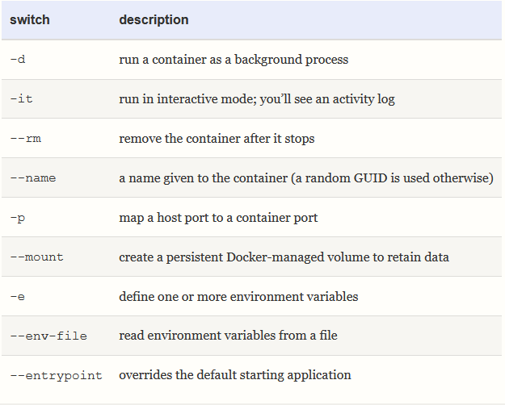
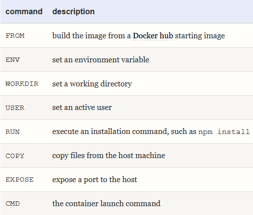

## Images

A Docker image is a snapshot of a file system and all application files. In some cases, you’ll use an image as is from the Docker Hub. It provides a wide range of popular applications including MySQL and MongoDB.

## Containers

A container is a running instance of an image. One or more containers can be launched from a single image, then used, and stopped as necessary.

`docker run [options]`



## Volumes

Docker provides two types of storage to retain container state.

- Volumes: a Docker-managed file system
- Bind mounts: a file or directory on the host machine.

## Networks

A container can communicate with another using standard protocols and ports within their own isolated network. Specific ports can be exposed to other containers and the host machine as necessary.

## Docker Compose

Docker Compose is a tool for managing multiple containers with associated volumes and networks. A single file named docker-compose.yml defines the configuration.

## Dockerfile

A Dockerfile defines the build steps required to create an image for the application. Various commands can be used, including these:



$PWD and Windows

$PWD is a reference to the current folder on Linux and macOS. It’s not available in Windows Powershell or cmd. Replace it with the full project path using Linux forward-slash notation—for example, /c/projects/nodetest.

## Cleaning Up

Docker can use significant disk space: enter docker system df to view usage statistics.

To clean up stopped containers and dangling images, volumes, and networks not currently associated with a container, enter:

```bash
docker system prune
```
Add -a to remove images, or -af to also include containers and networks.

All volumes can be removed with docker volume prune -f, but remember to back up any data you require before doing so!


## microservices course

### Docker

- `docker run -a <container_id>`: here `-a` make Docker actually watch for output from the container and print it out to your terminal
- `docker run` = `docker create` + `docker start`
- `docker ps -all`:
- `docker system prune`: delete everything related with images and container
- `docker logs <container_id>`: Gets logs from a container
- `docker stop <container_id>`: `-> SIGTERM`
- `docker kill <container_id>`: `-> SIGKILL`
- `docker exec -i(iNPUT)t(FORMATTING) <container_id> <command> sh(CONTROL SEVERAL COMMAND)`: Execute an additional command in a containe
- `docker run -it <container_name> sh`
- `docker build -t <docker_id>/<repo/project-name>:<version> .`
- `docker commit -c 'CMD ["<command>"]' <container_id>`: Take a container snapshot everything and create a new image from the snapshot 
- `docker run -p <post_on_localhost>:<port_on_container> <image_id/name>`: Docker run with Port Mapping

### Kubernetes

- **Kubernetes Cluster**: A collections of nodes + a master to mage them
- **Node**: A virtual machine that will run our containers
- **Pod**: More or less a running container 
- **Deployment**: Monitors a set of pods, make sure they are running and restarts them if they crash
- **Service**: Provides an easy-to-remember URL to access a running container
- `kubectl get pods`:
- `kubectl exec -it <pod_name> <cmd>`:
