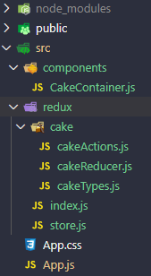

In this project we will learn how to work with redux in react based project:
## Contents
- [File-Structure](#file-structure)
- [Action](#action)
- [Reducer](#reducer)
- [Store](#store)
- [Subscribe](#subscribe)

## File-Structure



## Action
Actions are payloads of information that send data from your application to your store. They are the only source of information for the store. You send them to the store using `store.dispatch()`.


## Reducer
A reducer is a function that determines changes to an application’s state. It uses the action it receives to determine this change.
The reducer is a pure function that takes the previous state and an action, and returns the next state. 
```js
const contactReducer = (state = initialState, action) => {
  // Do something
}
```
State changes are based on a user’s interaction, or even something like a network request. If the application’s state is managed by Redux, the changes happen inside a reducer function — this is the only place where state changes happen. The reducer function makes use of the initial state of the application and something called action, to determine what the new state will look like. The state is meant to be immutable, meaning it shouldn’t be changed directly. To create an updated state, we can make use of `Object.assign` or opt for the `spread operator`. Earlier, we noted that the update that happens depends on the value of `action.type`. The switch statement conditionally determines the kind of update we're dealing with, based on the value of the `action.type`.
 


## Store
A [store](https://redux.js.org/api/store/) holds the whole state tree of your application. The only way to change the state inside it is to dispatch an action on it. A store is not a class. It's just an object with a few methods on it. To create it, pass your root reducing function to `createStore`.

   **Store Methods**
- getState()
- dispatch(action)
- subscribe(listener)
- replaceReducer(nextReducer)


## Subscribe


