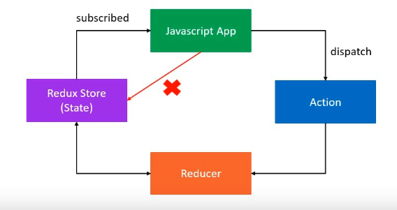

## Contents
- [Core-Concepts](#core-concepts)
- [Principles](#principles)
- [Demo-Principles](#demo-principles)
- [Folder-structure](#folder-structure)
- [My-Project](#my-project)
## Core-Concepts
- [Store] : Holds the state of your application
- [Action] : Describes what happened
- [Reducer] : Ties the store and actions together 
___
## Principles
- [First] : **The state of your whole application is stored in an object tree within a single store**
- [Second] : **The only way to change the state is to emit an action, an object describing what happened** e.g., `{type: ADD_ITEM }`
- [Third] : **To specify how the state tree is transformed by actions, you write pure reducers** e.g., `Reducer - (prevousState, action) => newState`



## Demo-Principles 
```js
const redux = require("redux");
const createStore = redux.createStore;

const BUY_CAKE = "BUY_CAKE";

// * action

function buyCake() {
  return {
    type: BUY_CAKE,
    info: "First redux action"
  };
}

// ? reducer

const initialState = {
  numOfCakes: 10
};

const reducer = (state = initialState, action) => {
  switch (action.type) {
    case BUY_CAKE:
      return {
        ...state, //copy state then change what it need
        numOfCakes: state.numOfCakes - 1
      };
    default:
      return state;
  }
};

// ! Store
// Holds application state
// Allows access to state via getState()
// allows state to be updated via dispatch(action)
// registers listeners via subscribe(listener)
// Handles unregistering of listeners via the function returned by subscribe(listener)

const store = createStore(reducer);

console.log("Initial state", store.getState());

//run whenever our state update
const unsubscribe = store.subscribe(() =>
  console.log("Updated state", store.getState())
);

store.dispatch(buyCake());
store.dispatch(buyCake());
store.dispatch(buyCake());

unsubscribe();
```


## Folder-structure

    redux
    │   root-reducer.js
    │   store.js
    │
    └───user
    │   │   user.actions.js
    │   │   user.reducer.js
___

## My-Project
### root-reducer.js:
```js
import { combineReducers } from 'redux';
import userReducer from './user/user.reducer';

export default combineReducers({
    user: userReducer
});
```
### store.js:
```js
import { createStore, applyMiddleware } from 'redux';
import logger from 'redux-logger';

import rootReducer from './root-reducer';

const middlewares = [logger];

const store = createStore(rootReducer,applyMiddleware(...middlewares));

export default store;
```
### user.actions.js:
```js
export const setCurrentUser = user => ({
    type: 'SET_CURRENT_USER',
    payload: user
})
```
### user.reducer.js:
```js
const INITIAL_STATE = {
    currentUser: null
}
const userReducer = (state = INITIAL_STATE, action) => {
    switch (action.type) {
        case 'SET_CURRENT_USER':
            return {
                ...state,
                currentUser: action.payload
            }
        default:
            return state;
    }
}

export default userReducer;
```
In order to pass data to other components we need to rewrite our logic in `app.js` Before that we need to pass the store to our app.js via `index.js`
```js  
<Provider store={store}>
    <BrowserRouter>
        <App />
    </BrowserRouter>
</Provider>
```
Then our `app.js` get store as props: 
```js
import { connect } from 'react-redux';
import { setCurrentUser } from  './redux/user/user.actions';
class App extends React.Component {
  unsubscribeFromAuth = null;
  componentDidMount() {
    const { setCurrentUser } = this.props; 
    this.unsubscribeFromAuth = auth.onAuthStateChanged(async userAuth => {
      if (userAuth) {
        const userRef = await createUserProfileDocument(userAuth);
        userRef.onSnapshot(snapShot => {
          setCurrentUser({
              id: snapShot.id,
              ...snapShot.data()
            })
        })
      }
        
        setCurrentUser(userAuth);

    })
  }
  componentWillUnmount() {
    this.unsubscribeFromAuth();
  }

  render () { ... }
}
const mapDispatchToProps = dispatch => ({
  setCurrentUser: user => dispatch(setCurrentUser(user))
})
export default connect(null,mapDispatchToProps)(App);
```
Now have a look how we can use the state in other component(like Header comp.):
```js
import { connect } from 'react-redux';
const Header = ({ currentUser }) => ( ... )
const mapStateToProps = (state) => ({
    currentUser: state.user.currentUser
});
export default connect(mapStateToProps)(Header);
```
___
